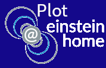
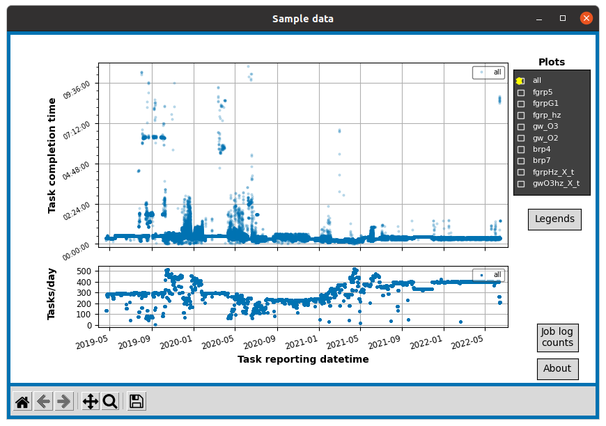
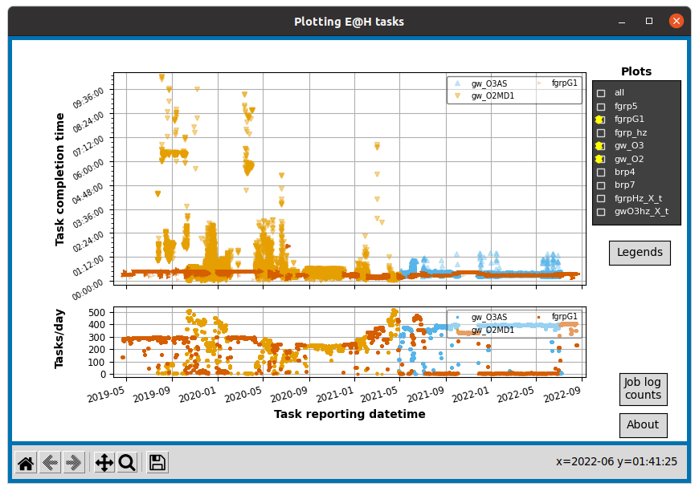
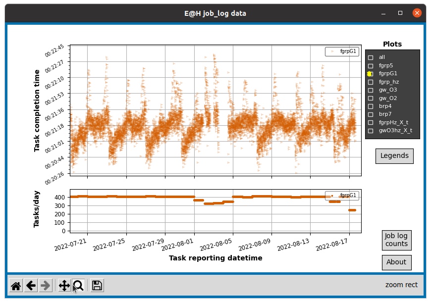
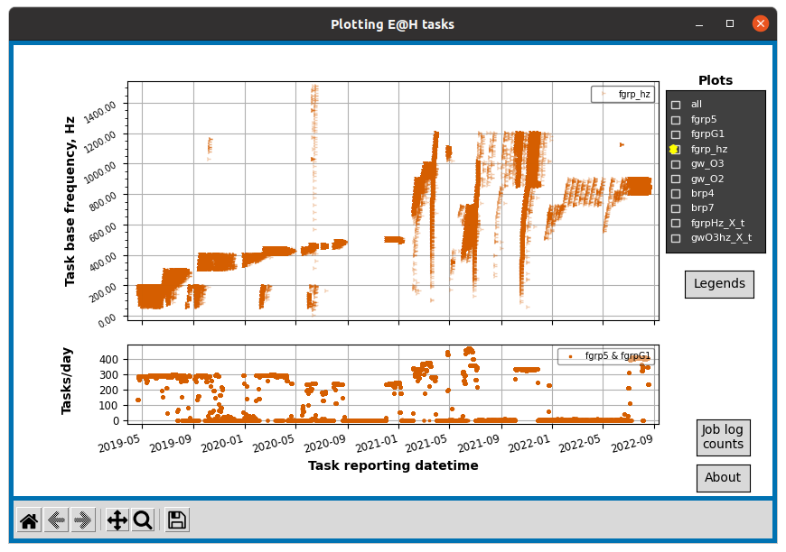
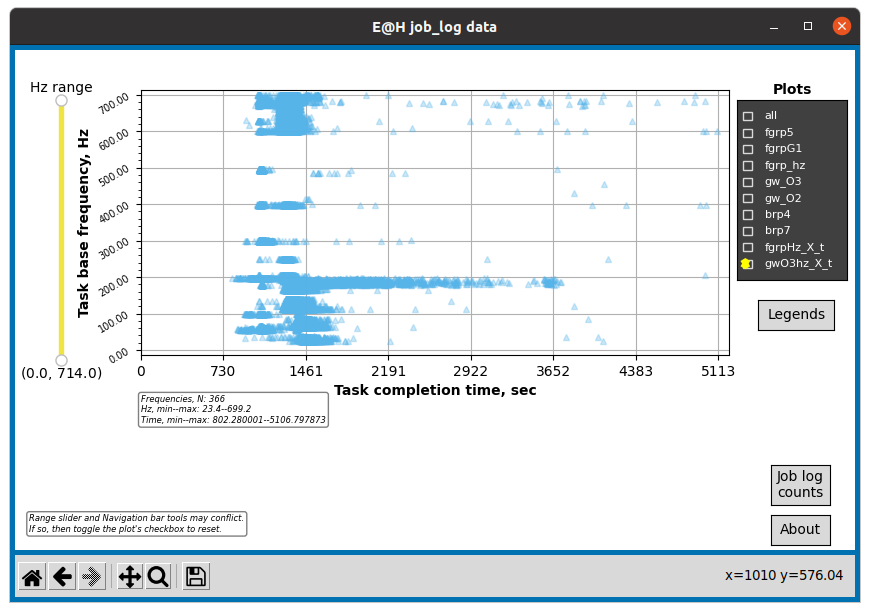
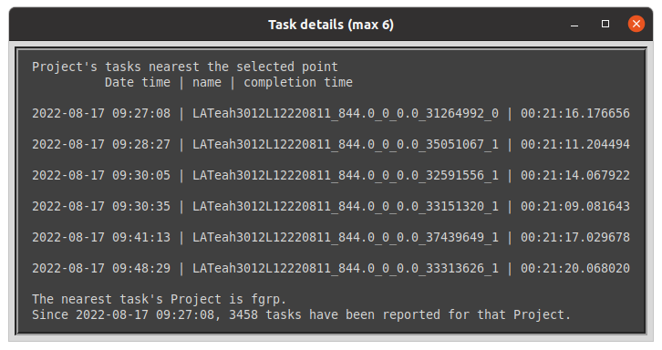
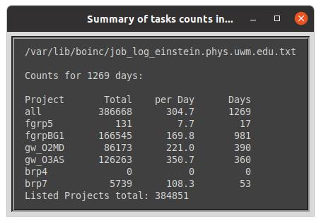

# Project: plot-einstein@home

## plot_jobs.py

The Python script, plot_jobs.py, draws plots from data in the Einstein@Home
BOINC client job log file, job_log_einstein.phys.uwm.edu.txt, or similarly structured data files, such as archive log files. Task times vs. datetime, task counts/day vs.
datetime, and task frequency (Hz) vs. task time (sec) can be plotted for
all E@H Projects recorded in a job log. A job log file can store
records of reported tasks for up to about three years of full-time work.

The program only reads files on a local host and does not connect to a user's E@H account.

### Usage:
From within the program's folder, use one of these Terminal or Command Prompt commands,
       depending on your system:

            python3 -m plot_jobs (recommended for all systems)
            py plot_jobs.py (Windows)
            python3 plot_jobs.py (Linux, Mac)
            ./plot_jobs.py (Linux, Mac)

Basic help: `python3 -m plot_jobs --help`

Information: `python3 -m plot_jobs --about`

Plot sample data: `python3 -m plot_jobs --test`

Plot with UTC (GMT) datetimes: `python3 -m plot_jobs --utc`
(Local datetimes are plotted by default.)

NOTE: Depending on your system, there may be a slight lag when first opening or switching between plots, so be patient and avoid the urge to start clicking around to speed things up. For the typical job log, hundreds of thousands to millions of data points can be plotted.

The default configuration reads the job_log_einstein.phys.uwm.edu.txt
file in its standard BOINC location. If you have changed the default
location, or want to plot data from an archived job_logs file, then
enter a custom file path in the provided plot_cfg.txt file.

Using the navigation bar, plots can be zoomed-in, panned, restored to
previous views, and copied to PNG files.
When no navigation bar button is active, clicking on a cluster or
single data point shows task names near the click coordinates.

The "Log counts" button shows, in a pop-up window and in the Terminal, summary counts of all tasks, by Project.

The "About" button prints to Terminal a description of the program, version number, repository URL, and copyright and license information.

### Requirements:
Python 3.7 or later, plus Matplotlib, Pandas, and Numpy.
This program was developed in Python 3.8-3.9.

For quick installation of the required Python PIP packages:
from the downloaded GitHub repository folder, run this command

    pip install -r requirements.txt
Alternative commands (system dependent):

    python3 -m pip install -r requirements.txt (recommended for all systems)
    py -m pip install -r requirements.txt (Windows)

### Known Issues:
Navigation bar icons images are not showing up in MacOS. They are functional, but may have reduced responsiveness' text descriptions of button functions are below the stub icons.

### Screenshots:

Opening window using the sample data option, --test.
Plots of task completion time and daily count vs. BOINC reporting date.
Using the navigation bar zoom tool, datetimes can scale down to month-date hour increments.

Overlaid plots of FGRPG1 gamma-ray and O2 and O3 gravitational wave tasks.

Zoom-in detail of FGRPG1 tasks times and counts.

Frequency (Hz) vs. datetime for all FGRP tasks

GWO3 tasks' Hz vs. task completion time, with Hz range selection slider.
The Hz range slider can be used as an alternative way to zoom in on frequency ranges. The slider and Navigation bar tools don't always work well together, so it is best to generally use one or the other.

Pop-up window of task information for tasks nearest a clicked plot coordinate. The cursor arrow to click on plot points appears when no navigation bar tools (pan or zoom) are active (highlighted).

The "Jop log counts" button gives a pop-up window of reported task totals for each Project.

### How Projects are identified

Projects listed under Plots are identified from their task names in the job_log file. Names are matched using regular expressions listed in the PROJ_NAME_REGEX dictionary in  plot_utils/project_groups.py. The general match patterns in task names are as follows.

E@H Project:&emsp;&emsp;&emsp;matching characters in name (0000 is any four digits)
- FGRP5:&emsp;&emsp;&emsp;&nbsp;'LATeah0000F'
- FGRPBG1:&emsp;&emsp;'LATeah0000L' or 'LATeah1049'
- O2MD series:&emsp;'_O2MD'
- O3AS1a:&emsp;&emsp;&emsp;'_O3AS'
- BRP4:&emsp;&emsp;&emsp;&emsp;name begins with 'p'
- BRP7:&emsp;&emsp;&emsp;&emsp;name begins with 'M'

### Keyboard shortcuts for navigation bar buttons and actions

| Action     | Key                      | Description                                                                |
|------------|--------------------------|----------------------------------------------------------------------------|
| fullscreen | f, ctrl+f                | toggle full screen display of plot window                                  |
| pan        | p                        | toggle click & drag to shift plot area, rt-click & drag zooms x and y axis |
| zoom       | o                        | toggle mouse rectangle draw to zoom in on a plot area                      |
| prior view | left arrow, c, backspace | back to previous custom view                                               |
| next view  | right arrow, v           | forward to next custom view                                                |
| home       | h, r, home               | return to original view                                                    |
| save       | s, ctrl+s                | save current view as PNG file                                              |
| quit       | ctrl+w, cmd+w, q         | close the plot window                                                      |
| grid       | g                        | cycle grid lines show/hide                                                 |
| grid_minor | G                        | cycle grid lines show/hide                                                 |
| yscale     | l                        | toggle scaling of y-axes ('log'/'linear')                                  |
| xscale     | k, L                     | toggle scaling of x-axes ('log'/'linear')                                  |
