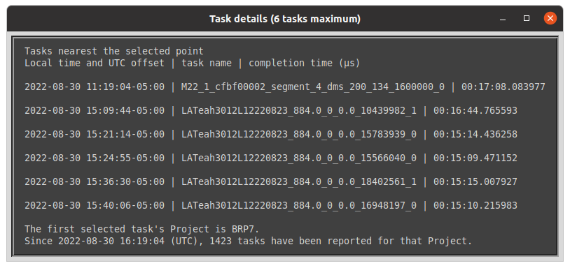

# Project: plot-einstein@home

## plot_jobs.py

The Python script, plot_jobs.py, draws plots from data in the Einstein@Home
BOINC client job log file, job_log_einstein.phys.uwm.edu.txt, or similarly structured data files, such as archive log files. Task times vs. datetime, task counts/day vs.
datetime, and task frequency (Hz) vs. task time (sec) can be plotted for
all E@H Projects recorded in a job log. A job log file can store
records of reported tasks for up to about three years of full-time work.

The program only reads files on a local host and does not connect to a user's E@H account.

### Usage:
From within the program's folder, use one of these Terminal or Command Prompt commands,
       depending on your system:

            python plot_jobs.py
            py plot_jobs.py
            ./plot_jobs.py
            python3 plot_jobs.py
Basic help: `python plot_jobs.py --help`

Information: `python plot_jobs.py --about`

Plot sample data: `python plot_jobs.py --test`

NOTE: Depending on your system, there may be a slight lag when switching
      between plots, so be patient and avoid the urge to start clicking
      around to speed things up. For the typical job log, hundreds of
      thousands to millions of data points can be plotted.

The default configuration reads the job_log_einstein.phys.uwm.edu.txt
file in its standard BOINC location. If you have changed the default
location, or want to plot data from an archived job_logs file, then
enter a custom file path in the provided plot_cfg.txt file.

Using the navigation bar, plots can be zoomed-in, panned, restored to
previous views, and copied to PNG files.
When no navigation bar button is active, clicking on a cluster or
single data point shows task names near the click coordinates.

The "Log counts" button shows, in a pop-up window and in the Terminal, summary counts of all tasks, by Project.

The "About" button prints to Terminal a description of the program, version number, repository URL, and copyright and license information.

### Requirements:
Python 3.7 or later, plus Matplotlib, Pandas, and Numpy.
This program was developed in Python 3.8-3.9.

For quick installation of the required Python PIP packages:
from the downloaded GitHub repository folder, run this command

    pip install -r requirements.txt
Alternative commands (system dependent):

    python -m pip install -r requirements.txt
    python3 -m pip install -r requirements.txt
    py -m pip install -r requirements.txt

### Known Issues:
Navigation bar icons images are not showing up in MacOS. They are functional, but may have reduced responsiveness. 

### Screenshots:

Opening window using the sample data option, --test.

Example plot of all gravitational wave tasks, by sub-series, over time.

Zoom-in detail of FGRPG1 tasks time and counts.

FGRPG1 gamma-ray task frequencies vs. task times.

Use Hz range slider as an alternative way to zoom in on frequency ranges. The slider and Navigation bar tools don't always work well together, so generally use one or the other.

Pop-up window of task information for tasks nearest a clicked plot coordinate.

### Keyboard shortcuts for navigation bar buttons and actions

| Action     | Key                      | Description                                                                |
|------------|--------------------------|----------------------------------------------------------------------------|
| fullscreen | f, ctrl+f                | toggle full screen display of plot window                                  |
| pan        | p                        | toggle click & drag to shift plot area, rt-click & drag zooms x and y axis |
| zoom       | o                        | toggle mouse rectangle draw to zoom in on a plot area                      |
| prior view | left arrow, c, backspace | back to previous custom view                                               |
| next view  | right arrow, v           | forward to next custom view                                                |
| home       | h, r, home               | return to original view                                                    |
| save       | s, ctrl+s                | save current view as PNG file                                              |
| quit       | ctrl+w, cmd+w, q         | close the plot window                                                      |
| grid       | g                        | cycle grid lines show/hide                                                 |
| grid_minor | G                        | cycle grid lines show/hide                                                 |
| yscale     | l                        | toggle scaling of y-axes ('log'/'linear')                                  |
| xscale     | k, L                     | toggle scaling of x-axes ('log'/'linear')                                  |

When no navigation bar buttons are active, clicking on task points displays task details.